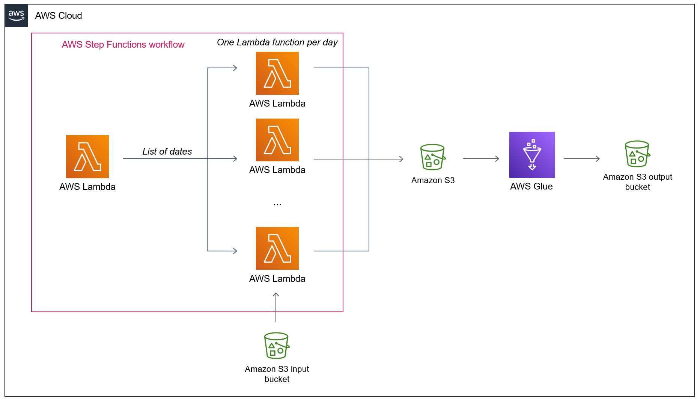

# ETL with Map state in distributed mode

This example creates a Step Functions workflow with a Map State in
DISTRIBUTED mode to extract data from a large dataset. The data is
extracted by Lambda functions executed in parallel. After the extraction,
the dataset is repartitioned by a Glue Job.



This example is built for extracting time series on given geographical
points from weather satellite images. The dataset used as an input is the
MSG Total and Diffuse Downward Surface Shortwave Flux (MDSSFTD) provided by
[EUMETSAT](https://www.eumetsat.int/).

## Prerequisites

Prior to deployment, issue command `aws configure` and then follow the
prompts to setup your AWS credentials and define the target account for the
deployment.

This example requires docker. It also requires 100GB of temporary disk space
to download the sample dataset before sending it to S3.

## Setup

Create a python virtual environment.

```
$ python3 -m venv .venv
```

After the init process completes and the virtualenv is created, you can use the following
step to activate your virtualenv.

```
$ source .venv/bin/activate
```

If you are a Windows platform, you would activate the virtualenv like this:

```
% .venv\Scripts\activate.bat
```

Once the virtualenv is activated, you can install the required dependencies.

```
pip install -r requirements.txt
```

This will install the AWS CDK and the necessary dependencies.

## Deploy

### CDK stack

1. Run `cdk bootstrap` to bootstrap the stack.
2. Run `cdk synth` to synthesize the CloudFormation template.
3. Run `cdk deploy`. This will deploy / redeploy your Stack to your AWS Account.

### Get the dataset and upload it to S3

After the deployment:

Register to the [data provider website](https://datalsasaf.lsasvcs.ipma.pt/) and download the sample data for the year 2018:

``` bash
wget -c --no-check-certificate -r -np -nH --user=[YOUR_USERNAME] --password=[YOUR_PASSWORD] \
     -R "*.html, *.tmp" \
     https://datalsasaf.lsasvcs.ipma.pt/PRODUCTS/MSG/MDSSFTD/NETCDF/2018/
```

When the download is complete, upload the dataset to the S3 bucket DataBucket created by the stack:

``` bash
aws s3 cp ./PRODUCTS/ s3://[YOUR_BUCKET_NAME]/ --recursive
```

Note: if you use temporary credentials, they might expire before the copy is complete. In this case, you can resume by using the `aws s3 sync` command.

## Run

* browse to the Step Functions console and start the execution of the workflow
* when completed, check that files have been created in the DataBucket, in `output/intermediate/`
* browse to the AWS Glue console,  select ETL jobs, and run the Glue job created by the stack
* when completed, check that files have been created in the DataBucket, in `output/final/`

## Clean up

To clean up and remove the stack:

```
cdk destroy
```

And delete the S3 buckets that have been created by the stack.

## Security

See [CONTRIBUTING](CONTRIBUTING.md#security-issue-notifications) for more information.

## License

Licensed under the MIT-0 License. See the LICENSE file.
